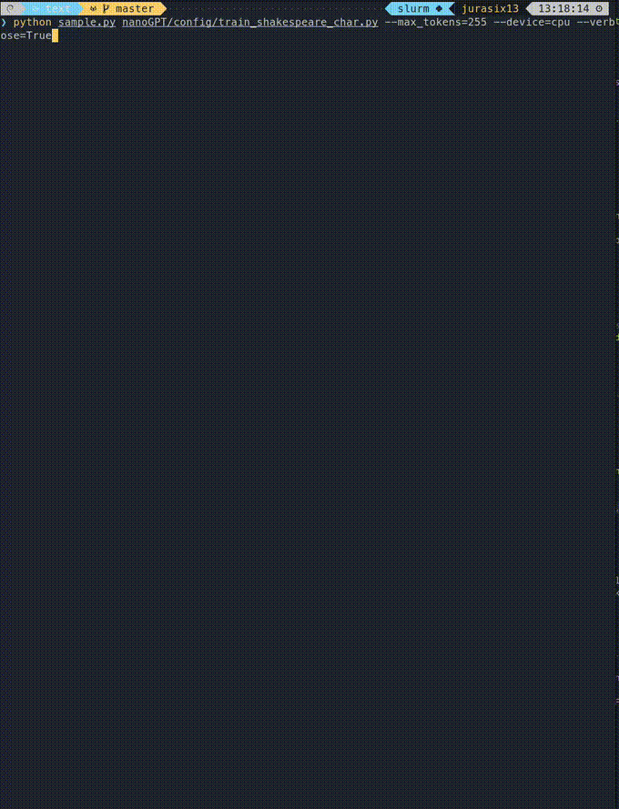

<!--
Copyright © 2024 Idiap Research Institute <contact@idiap.ch>

SPDX-FileContributor: Arnaud Pannatier <arnaud.pannatier@idiap.ch>

SPDX-License-Identifier: AGPL-3.0-only
-->

# $\sigma$-GPT: A New Approach to Autoregressive Models

<div align='center'>
  Burst-sampling from a character-level σ-GPT model trained on Shakespeare.
  
</div>


## Project Overview

Welcome to the $\sigma$-GPT project! This repository houses the implementation of $\sigma$-GPT, a model capable of generating signals in any direction. It includes a burst-sampling scheme that generates sequences in sublinear time. The methods and experiments here correspond to those presented in our paper, *$\sigma$-GPT: A New Approach to Autoregressive Models*, accepted at ECML/PKDD 2024.

[](https://x.com/ArnaudPannatier/status/1799055129829839166)
[](https://arxiv.org/abs/2404.09562)


## Credits

This repository is based on the following codebases:

- Picoclvr [https://fleuret.org/git/picoclvr](https://fleuret.org/git/picoclvr)
- NanoGPT [https://github.com/karpathy/nanoGPT](https://github.com/karpathy/nanoGPT)
  - With an additionnal KV cache implementation from Vincent Micheli and Eloi Alonso, from the IRIS codebase [https://github.com/eloialonso/iris](https://github.com/eloialonso/iris)

## One-Liner

Detailed instructions are provided below, but here are some one-liners to get you started:
It should work given that the environment is set up correctly.
More details are provided in the following sections.

**Install and text modeling on CPU**:
```bash
git clone git@github.com:idiap/sigma-gpt.git
cd sigma-gpt
git submodule update --init --recursive
cd text
(cd nanoGPT/data/shakespeare_char/; python prepare.py)
python train.py nanoGPT/config/train_shakespeare_char.py --max_iters=20000 --device=cpu
```

Then you can evaluate the model with:
```bash
python sample.py nanoGPT/config/train_shakespeare_char.py --device=cpu --max_tokens=255 --verbose=True
```
(remove the `--device=cpu` if you have a GPU, it should work with `mps` on recent Mac as well)


## Installation

The implementation is adapted from two well-known codebases: `picoclvr` from François Fleuret and `nanoGPT` from Andrej Karpathy. We organized the code so that the two codebases are imported as submodules.

First, clone the repository:

```bash
git clone ...
```

Then set up the submodules:

```bash
git submodule update --init --recursive
```


The environment.yml file contains all the required dependencies. You should be able to create a working environment by running this command in the main folder:

```bash
conda env create -n sigma-gpt -f environment.yml
```

## Usage

### Text modelling

For testing the model with fast training and evaluation on CPU, you can use the Shakespeare dataset. The model is trained on the character level.

First, go to the text folder:

```bash
cd text
```

And prepare the dataset:
```bash
(cd nanoGPT/data/shakespeare_char/; python prepare.py)
```

Then you can train with (remove the `--device=cpu` if you have a GPU, it should work with `mps` on recent Mac as well)


```bash
python train.py nanoGPT/config/train_shakespeare_char.py --device=cpu
```
Evaluation:
```bash
python sample.py nanoGPT/config/train_shakespeare_char.py --device=cpu --max_tokens=255 --verbose=True
```
with verbose set to `True` you can see the generation on the terminal.


For larger pipelines, you can try:

Training:
```bash
python train.py
```

```bash
python sample.py
```


### Non-NLP tasks
These commands train the model and output results for each epoch.
`main.py` contains many arguments that can be adapted to change the dataset, model size, number of layers, results folder, etc.

First, go to the non-nlp folder:

```bash
cd non-nlp
```
**Maze**:
```bash
python main.py --task maze --training_strategy="shuffle"
```

**Vertical**:
```bash
python main.py --task vertical --training_strategy="shuffle"
```

N.B: the air traffic dataset is not publicly available yet, the procedure is ongoing, and the dataset will be available soon. Reach out to the author for more information.
Once it is available it will be linked here.

## Minimal GPU specs
This repository contains rather small models, running without problem in a few hours on modest GPUs.

## License

This software is distributed under the LGPL-3.0 license. See the LICENSE file for more details.

## Project status

This code was developed as a part of the Innosuisse MALAT: Machine Learning for Air Traffic project, which is a partnership between SkySoft ATM and the Idiap Research Institute.

Main research partner: Pr. François Fleuret (UNIGE)

Project manager: Didier Berling (SkySoft ATM)

Author: Arnaud Pannatier <arnaud.pannatier@idiap.ch> (Idiap Research Institute).

For any questions/remarks about this work or this research, feel free to contact the author.

## Citation

If you use this code in your research, please cite the following paper:
```bibtex
@misc{pannatier2024sigmagpts,
      title={{\sigma}-GPTs: A New Approach to Autoregressive Models},
      author={Arnaud Pannatier and Evann Courdier and François Fleuret},
      year={2024},
      eprint={2404.09562},
      archivePrefix={arXiv},
      primaryClass={id='cs.LG'}
}
```
